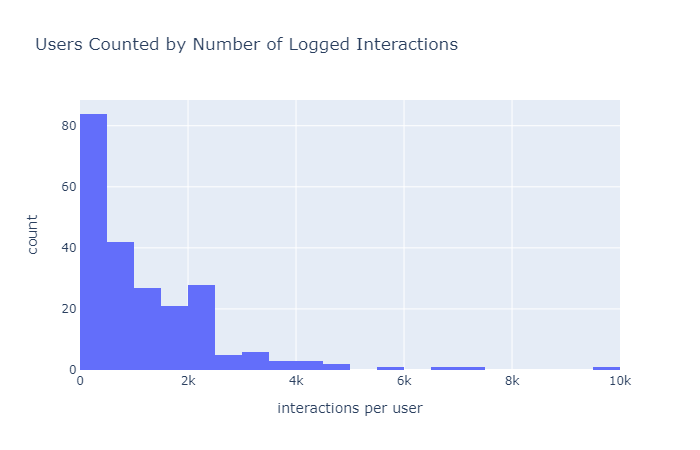
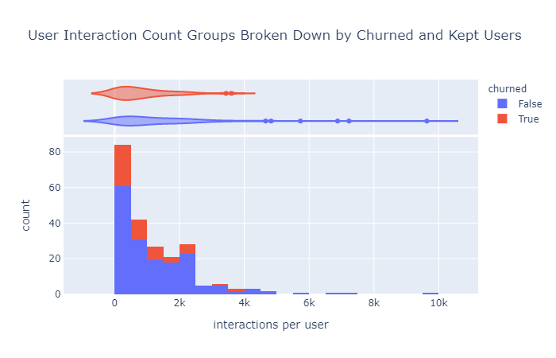
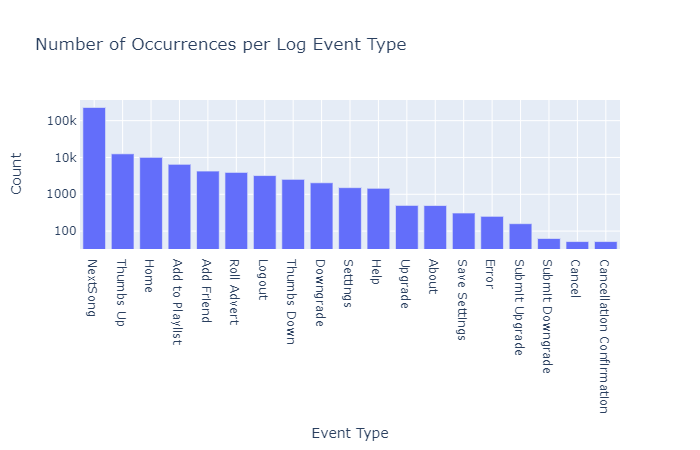
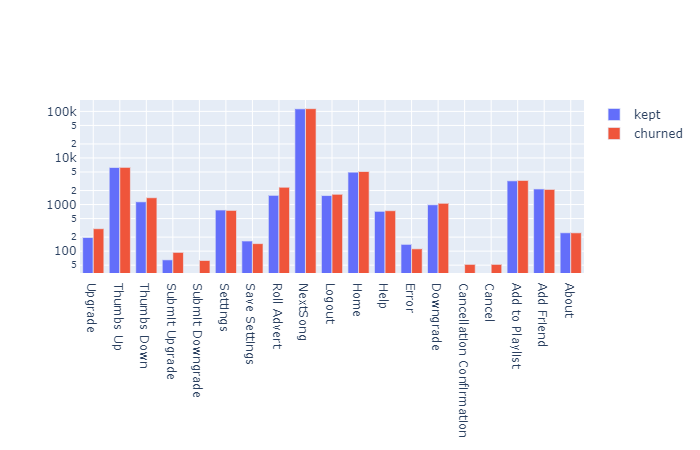

# Spark Churn
Application to predict whether a spotify user is likely to churn, i.e. to cancel or downgrade their subscription, 
based on their activity. User activity is read as a pre-processed web log in JSON format.

## Data Exploration

The initial data exploration was performed on a 120MB miniature subsample of the full data set. It contains 286500 raw 
 log entries, and has the following columns:
 
    |-- artist: string (nullable = true)
    |-- auth: string (nullable = true)
    |-- firstName: string (nullable = true)
    |-- gender: string (nullable = true)
    |-- itemInSession: integer (nullable = true)
    |-- lastName: string (nullable = true)
    |-- length: double (nullable = true)
    |-- level: string (nullable = true)
    |-- location: string (nullable = true)
    |-- method: string (nullable = true)
    |-- page: string (nullable = true)
    |-- registration: long (nullable = true)
    |-- sessionId: integer (nullable = true)
    |-- song: string (nullable = true)
    |-- status: integer (nullable = true)
    |-- ts: long (nullable = true)
    |-- userAgent: string (nullable = true)
    |-- userId: long (nullable = true)

Note that this schema is already typed via the schema definition and preprocessing described below.

8346 rows have empty userIds, so that 228108 usable log entries remain. I define churn as a user cancelling their 
subscription and I use "confirm cancellation" events in the log. I 52 of these in the log excerpt. It contains 225 
distinct userIds, 52 of which have churned, the remaining 173 users were kept.

The highest level comparison between users is the number of their logged interactions.

The plot shows that the number of interaction per user is widely distributed, roughly in the shape of a Poisson
distribution. Nearly all users have somewhere between 0 and 2500 interactions, but the users included in the 
log excerpt have up to 10000 interactions.
 
Breaking down the interaction counts between churned (defined as users who cancelled their subscription) and kept 
users, I find that, unsurprisingly, the kept users extend to the highest interaction counts, while the churned users 
are limited to somewhat lower interaction counts and have a more pronounced maximum at the low end. The former 
observation is natural, as users who keep their subscription will continue to interact, while cancelled users do not.
The larger number of low interaction count users is most likely caused by users who try out the service and decide
it is not the right choice for them.  

Moreover, the since the logs contain users who subscribed at different times, newer users will naturally have less 
interactions than older users. Based on these considerations, the sheer number of user interactions is correlated
to a user's likelihood of cancelling, but not a suitable predictor. However, the frequency of user interactions, 
i.e. their number of interactions per unit of time since their subscription, is a good measure of a user'S engagement 
with the service and therefore certainly part of their likelihood to cancel.   

The major feature of the log data is the distribution of event types per user. The figure below shows the number of 
occurrences of the different event types (names pages in the log). Since the event counts are so widely distributed, 
a logarithmic scale is necessary to make out any details - the event counts differ by a factor of > 1000 between the 
most frequent event (next song) and the least frequent (cancellation confirmation). The distribution does not hold 
any big surprises. The most interesting part is probably that the number of downgrades (2055) is about 4 times as 
large as the number of upgrades (499). It does indicate that the log data available for analysis apparently does not
follow all users since the beginning of their subscription. Another interesting observation is that "next song" makes 
up 82% of all log events (228108 of 278154 in the small version of the data set). The next most frequent event is 
"thumbs up" with 4.5%.
 

For a closer look, I will compare the event distributions between churned and kept users. Since the number of kept 
users is much larger than that of churned users, the data is normalized to the total number of events in each group.
Again, the fractions are plotted on a log scale to make it possible to compare all event types in a single plot.

First of all, only churned users have cancel and cancellation confirmation events, which is natural since having a
cancellation confirmation event is used as the criterion to define churn. The fractions of event types that do not 
differ much between both groups are "next song", "add to playlist", and "help". A small difference in "home" and 
"logout", which have a slightly higher fraction in churned users, may indicate that churned user sessions are a little 
shorter, but this feature can be extracted with more precision from the log time stamps and session ids.
 
The fact that churned users have a smaller fraction of error events than kept users indicates that problems with using 
the service are not what is driving people away. On the other hand, both "upgrade" and "roll advert" are clearly  more 
frequent with churned user. This hints that this user group feels more bothered by adverts than the kept users. This 
assumption can resolve the apparent paradox that upgrading the service is correlated with higher risk of user 
cancellation. Another pronounced difference can be found in the observation that churned users have less thumbs up and 
more thumbs down events. This is a clear indicator that dissatisfaction with either the available selection or the 
part of the selection users find by searching or recommendations drives the risk of service cancellation. 

## Operation

### Input Data Filtering
Most columns can be correctly typed upon reading, by providing schema information in DDL format to spark's JSON parser:

    in_schema = "artist STRING, auth STRING, firstName STRING, gender STRING, itemInSession INT, lastName STRING," \
                "length DOUBLE, level STRING, location STRING, method STRING, page STRING, registration LONG," \
                "sessionId INT, song STRING, status int, ts LONG, userAgent STRING, userId STRING"

Passing the schema directly to the JSON reader function avoids having to cast columns of the dataframe in memory, saving 
both RAM and compute operations. The exception to this is the userId column, which cannot be successfully parsed to any 
integer type by the JSON parser, presumably due to the use of empty strings for raw entries without userId. The column 
is read as string instead and then cast to long. Time stamps are imported as long integer, as they are interpreted 
wrongly by the import filter. For use as features for machine learning this is not problematic, they can be used in 
integer encoding. Therefore investing additional effort into parsing the timestamp columns is not warranted.

The input data contains entries with no associated user ID. Since these entries cannot be associated to a user, they
are useless for user behavior prediction and are therefore discarded.

Further pre-processing of the log data is not necessary.

### Feature Extraction
For prediction of user behavior, the log data is aggregated per user. A rich set of per-user features can be extracted 
easily by SQL-like operations:

* user base data:
    * gender
    * level - paid or unpaid subscription
    * level changed during the logged period
    * registration (time tamp)
* aggregated event data
    * mean number of log events per session
    * minimum number of events per session
    * maximum number of events per session
    * total number of log entries for this user
    * period - interval in days between earliest and latest log event - Determined by subtracting maximum and minimum 
      time stamp values
    * counts of log event types (pages) - Obtained by pivoting the page column and aggregating count
        * About
        * Add Friend
        * Add to Playlist
        * Error
        * Help
        * Home
        * Logout
        * NextSong
        * Roll Advert
        * Save Settings
        * Settings
        * Thumbs Down
        * Thumbs Up
        * Upgrade
        * Downgrade
        * Submit Downgrade
        * Submit Upgrade
    * frequencies of log event types - Defined as count / period for the events above per user
    * 1-hot encoded list of operating systems seen on userId - Obtained by splitting the user agent strings using a 
      regular expression and pivoting the resulting column. The OS determination is not ideal, sicne user agent strings 
      vary wildly, but the resulting strings are unique.
    * 1-hot encoded list of browser engines seen on userId - Same as operating system with the same problems. 
    
User first- and last name, as well as song names are not evaluated here. Song names would add a huge number of 
categorical variables and users outside the training set, on which the model would be used, are likely to have 
additional category levels.

Events interpreted as churn are deleted from the dataset:
* Cancellation Confirmation

Churn-related events that are deleted to avoid data leakage:
* Cancel

Some aggregates were removed during the training since they were identified as problematic:
* Time stamp of first log event - 
  Related to the age of the user account ad redundant with the registration time stamp
* Time stamp of latest log event - 
  Leads to data leakage and therefore over-fitting. A user who's latest log event is further in the past than others is
  very likely to have cancelled their subscription already
    
## Machine Learning

### Procedure
### Results

## Web Application

The web application is based on the scaffolding provided for the disaster response project.

## Prerequisites
### Python Version
Requires Python version 3.7 or higher (tested using version 3.8.3)

### Libraries
* jupyter 1.0.0
* numpy 1.19.1
* pandas 1.1.0
* plotly 4.8.2
* pyspark 3.0.0
* spark 2.5.4
* flask X.Y.Z
