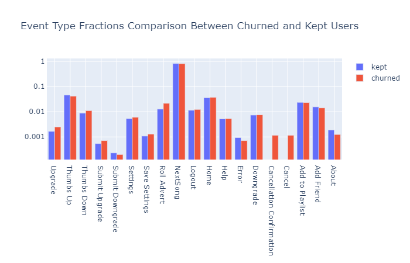
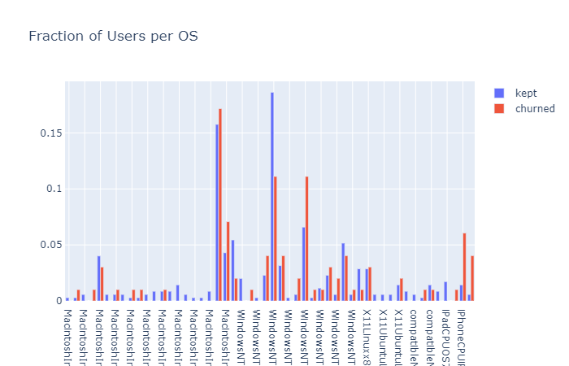
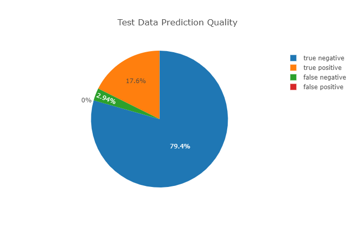

# Spark Churn
Application to predict whether a spotify user is likely to churn, i.e. to cancel or downgrade their subscription, 
based on their activity. User activity is read as a pre-processed web log in JSON format.

## Overview and Problem

The project is centered around user interaction logs from the audio streaming service Spotify. The problem is to help 
minimize user churn, i.e. users cancelling their subscription. To achieve this, those users who are likely to churn 
need to be identified. Since the user interaction logs contain nearly all the information Spotify has about their users, 
applying machine learning algorithms to identify such users is the most promising approach.

In the scope of this project, the problem to be solved is to generate a machine learning model which can classify users
who are likely to churn by analysis of their interaction log data.

Success shall be measured by the F1 score, which the final trained model achieves on a test subset of the provided log 
data. This score is particularly useful, as it relates the true positive rate to both types false classifications. The 
purpose of identifying users who are about to churn is being able to apply specific measures, such as special rebates or
other targeted customer retention measures. Since these measures are relatively expensive, it should be avoided to apply
them unnecessary (false positives). At the same time, missing such customers and therefore increasing the churn rate 
(false negatives) is equally negative. 

## Data Exploration

The initial data exploration was performed on a 120MB miniature subsample of the full data set. It contains 286500 raw 
 log entries, and has the following columns:
 
    |-- artist: string (nullable = true)
    |-- auth: string (nullable = true)
    |-- firstName: string (nullable = true)
    |-- gender: string (nullable = true)
    |-- itemInSession: integer (nullable = true)
    |-- lastName: string (nullable = true)
    |-- length: double (nullable = true)
    |-- level: string (nullable = true)
    |-- location: string (nullable = true)
    |-- method: string (nullable = true)
    |-- page: string (nullable = true)
    |-- registration: long (nullable = true)
    |-- sessionId: integer (nullable = true)
    |-- song: string (nullable = true)
    |-- status: integer (nullable = true)
    |-- ts: long (nullable = true)
    |-- userAgent: string (nullable = true)
    |-- userId: long (nullable = true)

Note that this schema is already typed via the schema definition and preprocessing described below.

8346 rows have empty userIds, so that 228108 usable log entries remain. I define churn as a user cancelling their 
subscription and I use "confirm cancellation" events in the log. I 52 of these in the log excerpt. It contains 225 
distinct userIds, 52 of which have churned, the remaining 173 users were kept.

The highest level comparison between users is the number of their logged interactions.

The plot shows that the number of interaction per user is widely distributed, roughly in the shape of a Poisson
distribution. Nearly all users have somewhere between 0 and 2500 interactions, but the users included in the 
log excerpt have up to 10000 interactions.
 
Breaking down the interaction counts between churned (defined as users who cancelled their subscription) and kept 
users, I find that, unsurprisingly, the kept users extend to the highest interaction counts, while the churned users 
are limited to somewhat lower interaction counts and have a more pronounced maximum at the low end. The former 
observation is natural, as users who keep their subscription will continue to interact, while cancelled users do not.
The larger number of low interaction count users is most likely caused by users who try out the service and decide
it is not the right choice for them.  

Moreover, the since the logs contain users who subscribed at different times, newer users will naturally have less 
interactions than older users. Based on these considerations, the sheer number of user interactions is correlated
to a user's likelihood of cancelling, but not a suitable predictor. However, the frequency of user interactions, 
i.e. their number of interactions per unit of time since their subscription, is a good measure of a user'S engagement 
with the service and therefore certainly part of their likelihood to cancel.   

The major feature of the log data is the distribution of event types per user. The figure below shows the number of 
occurrences of the different event types (names pages in the log). Since the event counts are so widely distributed, 
a logarithmic scale is necessary to make out any details - the event counts differ by a factor of > 1000 between the 
most frequent event (next song) and the least frequent (cancellation confirmation). The distribution does not hold 
any big surprises. The most interesting part is probably that the number of downgrades (2055) is about 4 times as 
large as the number of upgrades (499). It does indicate that the log data available for analysis apparently does not
follow all users since the beginning of their subscription. Another interesting observation is that "next song" makes 
up 82% of all log events (228108 of 278154 in the small version of the data set). The next most frequent event is 
"thumbs up" with 4.5%.
 

For a closer look, I will compare the event distributions between churned and kept users. Since the number of kept 
users is much larger than that of churned users, the data is normalized to the total number of events in each group.
Again, the fractions are plotted on a log scale to make it possible to compare all event types in a single plot.

First of all, only churned users have cancel and cancellation confirmation events, which is natural since having a
cancellation confirmation event is used as the criterion to define churn. The fractions of event types that do not 
differ much between both groups are "next song", "add to playlist", and "help". A small difference in "home" and 
"logout", which have a slightly higher fraction in churned users, may indicate that churned user sessions are a little 
shorter, but this feature can be extracted with more precision from the log time stamps and session ids.
 
The fact that churned users have a smaller fraction of error events than kept users indicates that problems with using 
the service are not what is driving people away. On the other hand, both "upgrade" and "roll advert" are clearly  more 
frequent with churned user. This hints that this user group feels more bothered by adverts than the kept users. This 
assumption can resolve the apparent paradox that upgrading the service is correlated with higher risk of user 
cancellation. Another pronounced difference can be found in the observation that churned users have less thumbs up and 
more thumbs down events. This is a clear indicator that dissatisfaction with either the available selection or the 
part of the selection users find by searching or recommendations drives the risk of service cancellation. 

Other information that may correlate to a user's likelihood to churn is their choice of operating system and web 
browser. These data will be extracted in the feature engineering section and will be discussed in the training results 
section below.

## Operation

### Input Data Filtering
Most columns can be correctly typed upon reading, by providing schema information in DDL format to spark's JSON parser:

    in_schema = "artist STRING, auth STRING, firstName STRING, gender STRING, itemInSession INT, lastName STRING," \
                "length DOUBLE, level STRING, location STRING, method STRING, page STRING, registration LONG," \
                "sessionId INT, song STRING, status int, ts LONG, userAgent STRING, userId STRING"

Passing the schema directly to the JSON reader function avoids having to cast columns of the dataframe in memory, saving 
both RAM and compute operations. The exception to this is the userId column, which cannot be successfully parsed to any 
integer type by the JSON parser, presumably due to the use of empty strings for raw entries without userId. The column 
is read as string instead and then cast to long. Time stamps are imported as long integer, as they are interpreted 
wrongly by the import filter. For use as features for machine learning this is not problematic, they can be used in 
integer encoding. Therefore investing additional effort into parsing the timestamp columns is not warranted.

The input data contains entries with no associated user ID. Since these entries cannot be associated to a user, they
are useless for user behavior prediction and are therefore discarded.

Further pre-processing of the log data is not necessary.

### Feature Extraction
For prediction of user behavior, the log data is aggregated per user. A rich set of per-user features can be extracted 
easily by SQL-like operations:

* user base data:
    * gender
    * level - paid or unpaid subscription
    * level changed during the logged period
    * registration (time tamp)
* aggregated event data
    * mean number of log events per session
    * minimum number of events per session
    * maximum number of events per session
    * total number of log entries for this user
    * period - interval in days between earliest and latest log event - Determined by subtracting maximum and minimum 
      time stamp values
    * counts of log event types (pages) - Obtained by pivoting the page column and aggregating count
        * About
        * Add Friend
        * Add to Playlist
        * Error
        * Help
        * Home
        * Logout
        * NextSong
        * Roll Advert
        * Save Settings
        * Settings
        * Thumbs Down
        * Thumbs Up
        * Upgrade
        * Downgrade
        * Submit Downgrade
        * Submit Upgrade
    * frequencies of log event types - Defined as count / period for the events above per user
    * 1-hot encoded list of operating systems seen on userId - Obtained by splitting the user agent strings using a 
      regular expression and pivoting the resulting column. The OS determination is not ideal, since user agent strings 
      vary wildly, but the resulting strings are unique.
      It should be noted that advancing browser versions can lead to these features becoming less relevant, the further
      the model training lies in the past, relative to new log data being analyzed.
    * 1-hot encoded list of browser engines seen on userId - Same as operating system with the same limitations. 
    
User first- and last name, as well as song names are not evaluated here. While on a much larger data set, user names 
might allow some groupings by cultural or economic background, a set of only 225 users cannot possibly allow any 
meaningul results in this regard. Therefore, the user's names must be regarded as random with respect to preferences and
churn likelihood.

Song names would add a huge number of categorical variables and users outside the training set, on which the model 
would be used, are likely to have additional category levels. Once can imagine extensive NLP analysis of song names to 
determine preferred genres or other song-related features, but such anlysis would only really make sense in combination 
with databases of additional song data.

Events interpreted as churn are deleted from the dataset:
* Cancellation Confirmation

Churn-related events that are deleted to avoid data leakage:
* Cancel

Some aggregates were removed during the training since they were identified as problematic:
* Time stamp of first log event - 
  Related to the age of the user account and redundant with the registration time stamp
* Time stamp of latest log event - 
  Leads to data leakage and therefore over-fitting. A user who's latest log event is further in the past than others is
  very likely to have cancelled their subscription already
    
## Machine Learning

The goal of the machine learning in this project is to predict from a users log history, whether this user is likely to
churn or not. This is a classification problem. For the initial exploration, I decided to try logistic regression, 
random forest classification and linear support vector classification. After hyperparameter tuning of the three methods, 
I will use the best performing one with the best set of parameters on a larger dataset to train a production model.

### Procedure

For training end evaluation, the data will be split into tree parts for the exploration and into two parts for training 
the production model. The split is performed by user, on the dataframe of features and labels. Splitting the log data, 
would require stratifying by userId, and invole reshuffling the big, pre-aggregation dataset.

In the exploration part, I split the data into 10% + 15% + 75% parts, for testing of the trained models, 15% for 
validation within the hyperparameter tuning and 80% for training. The 5% test data are split off using, the randomSplit 
method, the split between training and validation data has to be done using the TrainValidationSplit class in the 
Spark mllib to perform automatic model parameter tuning. To obtain the desired 15%/75% split of the data, a trainRatio 
parameter of 0.8333... has to be used (0.75 / 0.90). 

The data pre-processing is performed by subclassing the mllib Transformer class. To obtain a maintainable code structure, 
I split the preprocessing into the following structure:

* LogCleanTransformer - Performs the log data cleaning, i.e. dropping all rows with empty userId
* UserLogTransformer - Performs the feature extraction and returns a dataframe containing userId and the extracted 
  feature columns.
* UserLabelTransformer - Creates a 'label' column marking churned users as 1 and non-churned users as 0
* TrainingAssembler - Assembles the feature columns into a vector suitable for the classifiers in mllib. 
* MasterTransformer - Applies the UserLabelTransformer and TrainingAssembler on the cleaned data for model training

After training and tuning the models, the classifier that achieved the best F1 score is trained on a medium size data 
set using a cloud instance in IBM Watson Studio. The Notebook used for this training is Sparkify_IBM.ipynb. There, the 
best parameters identified in the exploration are used. Therefore, the train-validation split is not required any more.
Instead, only the 10% test data is split off and used to calculate the F1 score of the trained model's predictions, to 
guard against over-fitting.

### Results

#### ML Exploration

The tested classifiers are logistic regression, random forest classification and linear support vector classification. 
For logistic regression and linear SVC, I tune the maximum iterations and regularization parameter, for random forest 
classification I tune the maximum depth and number of trees. 

The comparison between classifiers is done on the basis of the F1 score on the test set, using the optimized parameters.
The results shown in the table below indicate that linear SVC quite clearly performs better than the two others, which 
in turn have very similar performance.  

Classifier | F1 Score | Parameter 1 | Parameter 2
---------- | -------- | ----------- | -----------
Logistic Regression | 0.461 | maxIter = 300 | regParam = 0.01
Random Forest | 0.444 | maxDepth = 3 | numTrees = 100
Linear Support Vector Classification | 0.571 | maxIter = 100 | regParam = 0.0

The hyperparameters found to best for the classifiers are also given in the table above. I chose to optimize two 
parameters per classifier on approximately logarithmic grids. 

The maximum iterations parameter of the logistic regression classifier of 300 is the upper bound of the parameter grid, 
which indicates that the logistic regression fit is not converging well, even though a  quite strong L2 regularization 
of lambda=0.01 is applied. This result indicated that logistic regression is very well suited to the problem at hand. 
300 iterations is a quite large value and a least squares regression that does not converge within 300 iterations is 
unlikely to converge at all.

The parameters of the random forest classifier hit the minimum depth of the parameter grid, and a depth of 3 is 
basically the minimum depth that makes sense. Again, together with reaching the lowest F1 score of the tested methods,
this strongly indicates that random forest classification is not the right method for the problem at hand.

The linear SVC shows best performance with a regularization parameter of 0, i.e. no regularization at all. With a 
maximum iterations count of 100, away from the grid edges, and a clearly better F1 score, linear SVC shows the best 
performance of the investigated classifiers. 

The F1 scores for all three classifiers are not impressive. The relatively weak performance can be attributed to the 
small training set used in the local exploration. This assumption will be tested in the next step by using a larger 
data set to train the model. 

#### Linear Support Vector Classification on Medium Data Set

The medium sized data set used for training in the IBM cloud has log data on 448 distinct users. 34 of these are used for
testing, the remaining 414 for training of the model.

First, I shall investigate the initial hypothesis that user engagement with the Spotify service should be a predictor 
for the risk of user churn. A good indicator of engagement is the average number of log events in a session per user. 
The plot below shows a histograms of average event counts per session for churned and kept users. Contrary to 
the initial hypothesis, there is no clear difference between the two user groups. The only observation is that more 
churned users have very high event counts per session. However, these only make up a small fraction of all churned 
users. Still, the feature is likely to give context to the counts and frequencies of different event types, such as 
the "roll advert" and "next song" events examined further down.

The browser distribution shows a strong overrepresentation of Safari browsers, a significant number of Firefox (Firefox 
and Gecko) users and only very few Internet Explorer (Trident) users. There are discernibly differences in churn rates 
between different browser versions, but no clear trends between platforms, except a slightly higher representation of 
Firefox among churned users. 
   

Within the operating systems it is interesting to see that the OS version but not the family shows a significant 
difference between churned and non churned users. I.e. there are high and low churn rates for different versions of 
both Windows and MacOS. The only platform that clearly indicates churn risk is IPhone usage. 
It should be noted, that both the OS and browser fractions will add  up to more than 1, since users are rather likely 
to have accessed spotify using more than one browser or operating system version.

The frequency of advertisements rolled out to users per month is quite interesting. It is obtained by dividing the 
number of roll advert events by the difference between earliest and latest event time stamp in months. To make the 
histogram readable, it is necessary to show the percentage axis in logarithmic scale. It can be seen, the the 
majority of non-churned users dies not get any adverts at all. This is likely more correlated to the paid subscription 
status than the effect of adverts. It cannot be decided if adverts are driving users away, or if they were not 
interested enough in the service to pay for a subscription in the first place. 

To answer the question, whether the subscription level or advertisements are more important in determining user churn, 
it is interesting to look at the distribution of the user's maximum subscription level. This is 1 if the user ever 
produced log events while in paid subscription status. Interestingly, here the fraction of one time paid subscribers 
is higher among the churned users than the kept ones (even though the difference is small). This hints clearly that the 
effect of the advert roll frequency is more directly linked to the advertisements and not a side effect of paid 
subscription.  

The distribution of "next song" frequencies shown below basically confirms the hypothesis proposed in the exploration 
selection above. Next song can either be triggered by a song ending and the playlist advancing, or the user skipping a 
song. Therefore, high frequency of next song events indicates that the respective user does not like the music played 
to them. If a users is dissatisfied with the available selections or recommendations, they are more likely to leave. 
Tellingly, 62% of the non-churned users have less than 20 next song events per month. Curiously, one user has over 400
next song events per month, but so far has not minded enough to give up.

Looking at the log periods, i.e. is the time difference between earliest and latest log events, the distribution of the 
kept users is quite interesting. The number is constantly low between 0-30 months, then rises roughly linear. If Spotify 
was gaining users at constant pace, the users per period interval should be roughly constant. The rise towards long 
periods indicates that Spotify is approaching peak market penetration. In contrast, the distribution of churned users 
is not surprising. Apparently a user is more likely to churn relatively early on, which is consistent with the 
observation that dissatisfaction with the music selection dives churn. Users are likely to decide this rather earlier 
than later, instead of waiting a long time for the selection to improve. 

The final trained model's *F1 score is 0.923*, which constitutes a remarkable improvement over the accuracy that could 
be obtained on the small size data set. It confirms the assumption, that the exploration data set is simply too small 
to suffiently train an ML classifier. The figure below shows the confusion matrix as a pie chart.

 

In table form, the confusion matrix is:

|churn|actual|true|false
|-----|------|----|-----
**predicted**|**true**|6|0
**predicted**|**false**|1|27

On the test data set, the model produced only one false prediction, which was a false negative.

Overall, based on the available test data the model performs very well. It should be useful to classify users and give 
warning about users who may be close to cancelling their subscription.

### Challenges Encountered

Initially, I planned to fit a production model on the full data set using AWS elastic map reduce. However, I was not 
able to set up a notebook on any EMR cluster. In any attempt, the notebooks would not start on the cluster with 
permissions error messages. After spending over 15 hours trying to get notebooks to run, neither following the 
(outdated) course instructions which do not fit the current version of the EMR console any more, nor trying to follow 
other instructions. Most likely some configuration aspect of my personal AWS account was preventing successful cluster 
deployment. I then decided to use the IBM Watson Studio option instead. 

At the time of fitting the medium data set in the IBM cloud, the feature extraction used unrestricted pivot operations 
on the user agent column. This turned out to be a problem, as different values were present in the small exploration 
set and medium size set used for model training. In fact, it can be expected that even more different values will be 
present in the full data set. 

Specifically, 10 additional features were extracted from the medium size data set, 1 Additional version of Safari and 
9 Additional OS versions. To be able to reconstruct the feature columns from the feature vectors, the features were 
reanalyzed in IBM_Feature_Results.ipynb. Value lists were added to model.py for known operating systems, browsers and 
log messages. All pivot operations were adapted to use the respective fixed lists of known features to generate 
consistent sets of feature columns, independent of the data set. This is not only necessary for consistent results 
between fit data sets, but also to generate feature vectors consistent with the model, when performing inference on 
data sets distinct from the fitting set. 

Analysis of the dataset had to be updated as some data was assigned to wrong columns by FeatureUnassembler. Conclusion
details changed slightly.

### Improvement Opportunities

The main opportunity for improvement lies in the extraction of operating system and browser featrues. In the current 
state. strings are extracted quite simple regular expressions. As a result, the operating system strings contain 
leaked browser version components. The root cause lies in the ill defined format of user agent strings, which results 
in a zoo of formats used by different vendors. A larger data set will probably warrant expending more effort on a 
cleaner data extraction. Possibly a third party library exists which could be used. On top of that, 

Another possible area for improvement is in the format of the log data itself. JSON is a really inefficient storage 
format with so much overhead, that even CSV would be preferable. For the strictly columnar log data, a format like 
parquet would offer large efficiency gains with larger data sets.

The security of the web application must to be improved. Currently no limits or checks are performed on the uploaded 
log files. This is clearly unsuitable for a production or public facing environment.

Many general improvements on the web application are conceivable, including adding of spinners and progress indicators 
for the inference page, which is slow on the puny virtual machine used for hosting the web application. 

### Web Application

The web application is based on the scaffolding provided for the disaster response project. 

### Usage

The main page displays a dashboard view of the training data sets, training results and feature statistics.

Churn risk can be inferred using the model trained in IBM Watson studio by selecting a log file in the same json format 
as the training data. To analyze a log, select the file in the Form at the top of the main page and press the 
"Upload and Classify" button. The classification process wil take while, depending on the CPU speed of the web server.

The classification results will be displayed as a list of users ids with green background, if the user is classified as 
not churned. A red background will mark users found likely to churn.

### Installation instructions

To setup a simple version of the web application, install a python venv which fulfills the following requirements. 

* Python >= 3.6.9
* Flask>=1.1.0
* numpy>=1.19.0
* pandas>=1.1.0
* plotly>=4.10.0
* pyspark>=3.0.0

Copy the contents of the app subdirectory of the git repository into an appropriate directory on the web application 
server.

Ensure the JAVA_HOME environment variable points to a JDK installation compatible with the spark implementation to be 
used. Ensure the SPARK_HOME environment variable points to a local spark installation of at least version 2.5.4.

Run the development server by calling

    python run.py    

from within the app directory. Alternatively, the app can be run through a WSGI server.

## Prerequisites
### Python Version
Requires Python version 3.6.9 or higher (tested using version 3.8.3)

### Libraries
* jupyter >= 1.0.0
* numpy >= 1.19.1
* pandas >= 1.1.0
* plotly >= 4.8.2
* pyspark >= 3.0.0
* spark >= 2.5.4
* flask >= 1.1.0

## References

* File upload handling in the web app adapted from tutorial content at 
  [roytuts.com](https://www.roytuts.com/python-flask-file-upload-example/)
* Web application scaffolding taken from the disaster response pipeline course project